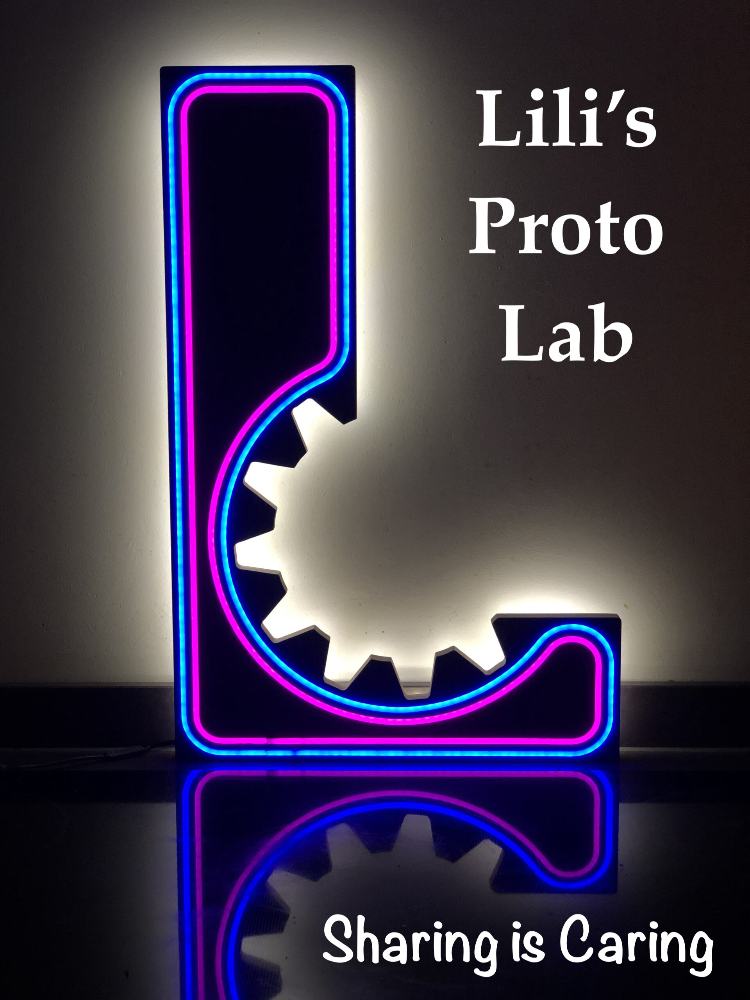

# FDM print station
For a number of FDM 3D printing materials it is of importance to store and use them under low relative humidity conditions. 
For this purpose a station was designed, containing an adapter drawer with two storage compartments, and three 3D printer compartments. For each compartment relative humidity (and temperature) can be monitored and controlled by flushing with dried compressed air. 


## Main features
This FDM print station contains:
+ A humidity control system
	+ Building-supplied compressed air is fed through a membrane dryer (DM08G-19KA-N) to reduce the moisture level
   	+ Each compartment contains a sensor unit which monitors temperature, humidity and door open status
   		+ Door sensors make sure flushing is only active while the compartments are closed
   	+ Five electronic valves direct the flow of pressured air to each compartment
   	+ Dried air is distributed to five compartments: two drawer compartments, and three printer compartments
   	+ Home Assistant integration controls the humidity setpoints for the drawer compartments (typically 12%) and the printer enclosures (typically 20%)
+ One filament storage drawer with two compartments
	+ A pre-existing drawer is supplemented with a transparant PMMA enclosure for convenient selection of materials with the lids closed	
	+ A screen mounted to the drawer displays the current humidity, temperature and door sensors + flushing status of all compartments
+ Three printer enclosures
	+ vertical sliding doors for minimal obstruction from 5mm PMMA sheets, with 3D printed handles and latches.
	+  The exhaust ventilation is connected to the building exhaust system and controlled via manual, 3D printed gate valves.
	+ The enclosure is made from aluminium extrusions with 3mm PMMA sheet walls


```
.
|--- Build 
|--- Docs
|--- Results
|--- Software
| LICENSE
| README.md

```

The purpose of each subfolder is explained below:
+ Build: Contains all the (binary) design files that are needed for the hardware. Use subfolder for more complex assemblies.
+ Docs: Contains the documentation of the project: background information, sources, warnings, and build instructions. 
+ Results: For measurement or functional devices, it is good to report some results as a benchmark for others who try to replicate the project.
+ Software: For hardware projects that have an operating software or firmware, it is a good versioning practice to separate the software code from build instructions.

## Build instructions
_Guide the reader with the order of browsing your project repository for an optimum building experience_
 
When you want to start a new repository, it is better that you copy this repository to your project repository and start by changing all the description.
All instructions and (sub)headers are suggestions. You can change the style, order, or composition as you see necessary. 

It would be kind if you put a shortcut to your Bill of Materials file.
This template can be copied free of charge. 

## Outcomes


## Team
+ Project initiator: Pieter Kooijman @pkooijman
+ Contributors:
	+ Josh Hauser @catovector
 	+ Nico van Hijningen

## Get involved
_Especially for open source projects, it is benefitial to motivate the potential users of the project to contribute back or share their feedback. Make it easy for them._

Comments and suggestions on this folder structure are always welcome. Please create an issue to share your feedback or question, or if you prefer send a pull request. 

Better structured projects can explain a number of options for contributors such as: 
+ (where to start)
+ (issue template)
+ (direct contact)
+ (pull requests)

## License
_After the README, A LICENSE is the most important file in the project documentation. Without a license, there is too much uncertainty to try building anything on top of the original project._

This project is released under CC0 1.0 Universal. 
You can modify an reuse as you like.
The project team appreciates your suggestions or examples for enhancing the repository, but your consistent documentation of your project is the best gift to the world. Hopefully, this template could make that a bit easier for you. 

### (How to cite:)
_Additionally, you can specify how other can cite your project._

## (Funding)
_Be kind to your funders and mention their support visibly and consistently. They also need to show their resources are wisely spent._


